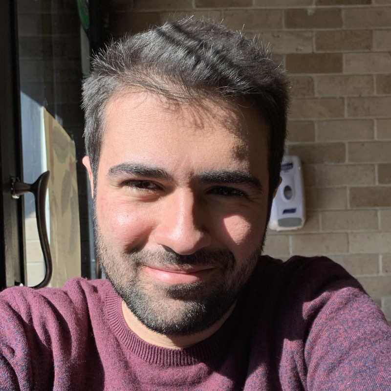

 
    

 <b>Arya Chavoshi, </b>   <em>Graduate Research Assistant</em> 

 <a href="https://www.caee.utexas.edu" target="blank">Department of Civil, Architectural, and Environmental Engineering</a> 
<a href="https://utexas.edu" target="blank">The University of Texas at Austin</a>

 <a href="files/CV.pdf">Curriculum vitae </a> 

 

I obtained my Bachelor's in Civil, and Environmental Engineering from [Sharif University of Technology](https://www.sharif.edu) in August 2021. During my undergraduate degree, I developed a forward uncertainty quantification framework by coupling Monte-Carlo sampling with stochastic time series generation to obtain a probabilistic estimation of the Lake Urmia- groundwater interaction. I published this project in the Journal of Hydrology (https://www.sciencedirect.com/science/article/pii/S002216942200453X) under the supervision of [Dr. Mohammad Danesh-Yazdi](http://sina.sharif.edu/~danesh/)([Dept. of Civil and Environmental Engineering]).

I completed my postdoctoral training at the [Center for Applied Scientific Computing (CASC)](http://computation.llnl.gov/casc/) of [Lawrence Livermore National Laboratory (LLNL)](https://llnl.gov/) (February 2013 - February 2015), working with [Dr. Panayot Vassilevski](http://people.llnl.gov/vassilevski1) on algebraic multigrid and numerical upscaling techniques with applications to flow in porous media. After completing my postdoc, I joined the [Oden Institute for Computational Engineering and Sciences](http://oden.utexas.edu/) of [The University of Texas at Austin](http://utexas.edu/) (March 2015-July 2018) as a Reseach Associate, working with [Prof. Omar Ghattas](http://users.oden.utexas.edu/~omar) on scalable numerical methods for the solution of Bayesian inverse problems, uncertainty quantification and propagation, optimal experimental design, and optimization under uncertainty.  

After spending four years as a Research Assistant Professor of [Electrical and Systems Engeneering (ESE)](https://ese.wustl.edu/Pages/default.aspx) at [Washington University in St. Louis](https://wustl.edu) and member of the [PhD in Imaging Science Faculty](https://engineering.wustl.edu/departments-faculty/interdisciplinary-degree-programs/imaging-science/Pages/default.aspx), I rejoined the Oden Institute in the August 2022 as a Research Scientist working at the interface of imaging science and predictive scientific computing. 

