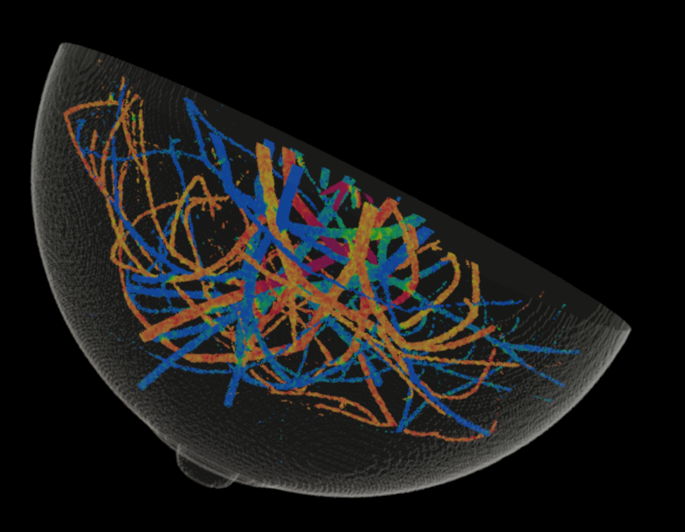
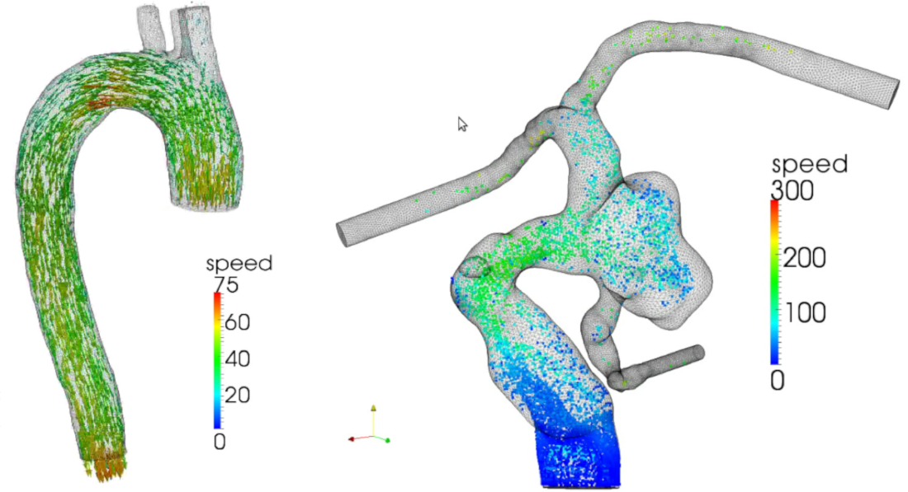
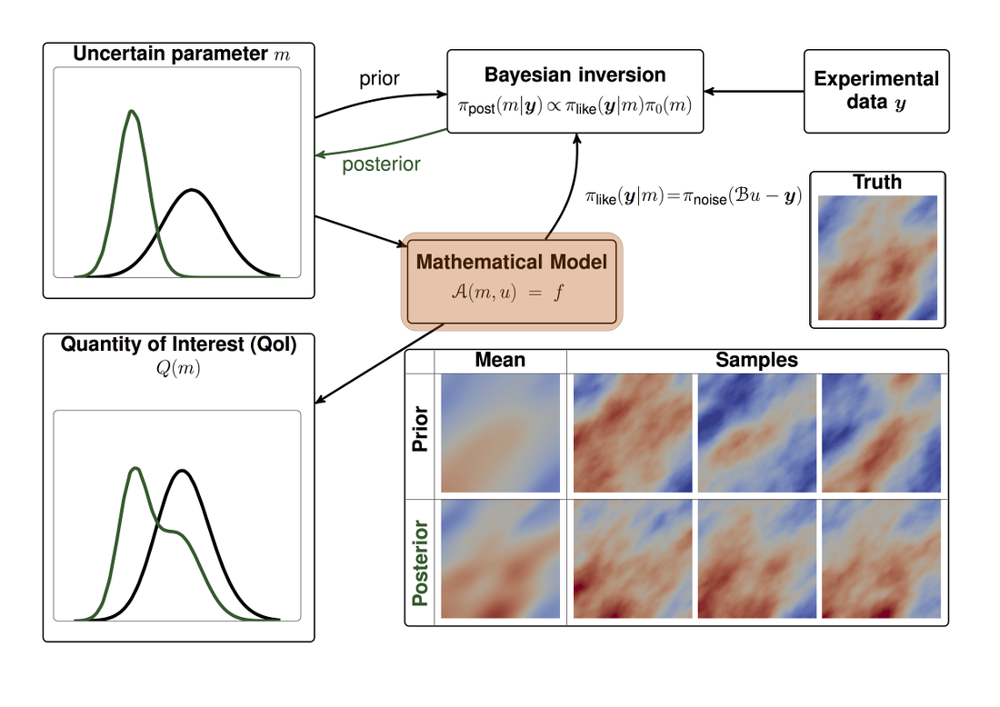
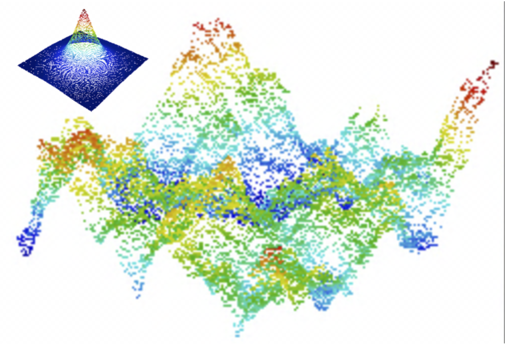
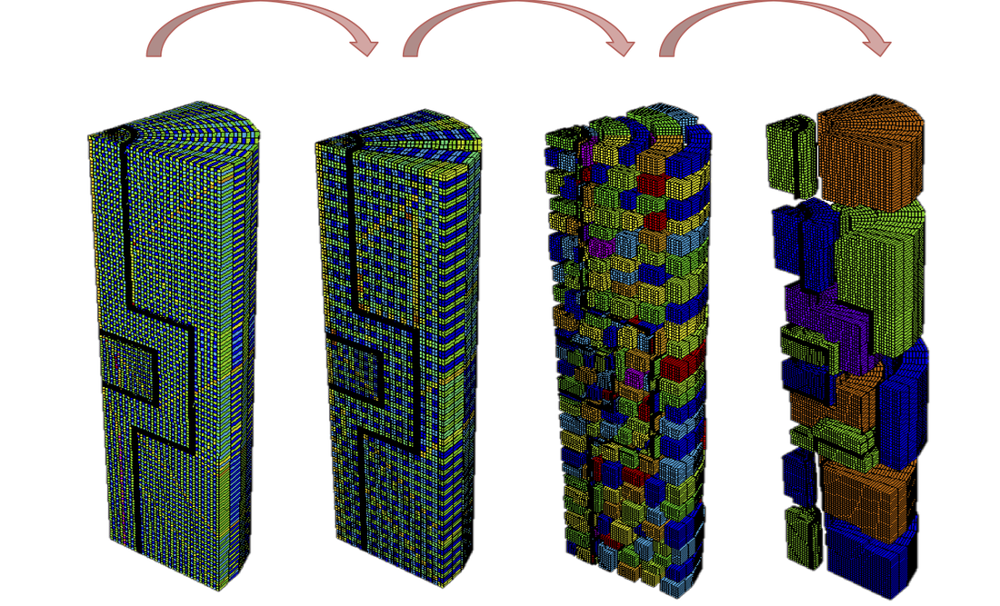

## Research highlights

I define myself as a mathematical engineer and computational scientist. My work focuses on advancing our understanding of physical and biological phenomena, improving the design of engineering systems, and supporting informed decision-making under uncertainty by use of mathematical/statistical modeling and high-performance computing. An important component of my work is the systematic integration of mathematical models and data (e.g., experimental measures and images) using the Bayesian framework. Throughout my career, I have led the development of novel formulations and algorithms for the solution of both forward and inverse problems. I have achieved this by establishing a close working collaboration with some of the leading research experts in the fields of medical imaging, geophysics, engineering, computational sciences, and applied mathematics.

During my doctoral program and postdoctoral training, I made several important contributions to the field of computational science and engineering, and more specifically with regards to the use of large-scale numerical simulation as a tool to inform decision making under uncertainty. These included the use of patient-specific computational hemodynamics simulations to quantify wall shear stress and predict the risk of rupture of an aneurysm; the optimal control of the inlet condition of a turbulent jet to ensure proper mixing; and the use of information theoretic approaches (expected information gain) to optimally designing sensing systems.

As a Research Assistant Professor at Washington University, I am working on several projects aiming at advancing quantitative and functional image reconstruction algorithms with the ultimate goal of advancing the state-of-care for cancer diagnosis and treatment. In particular, my focus is on emerging acoustic and optical imaging modalities, such as photoacoustic computed tomography (PACT) and ultrasound computed tomography (USCT).

Find me on: [Google Scholar](https://scholar.google.com/citations?user=lELCubQAAAAJ&hl=en), [Academia](https://utexas.academia.edu/UmbertoVilla), or [Research Gate](https://www.researchgate.net/profile/Umberto_Villa).

| |  |
| :---: | :---: |
| **Reconstruction algorithms for emerging medical imaging technologies (quantitative photoacoustic computed tomography)** | **Computational hemodynamics** |
|  |  |
| **The process of extracting knowledge from data by solving inverse problems** | **Bayesian optimal design of experiments with sparsifying penalty** |
|  |  |
| **Scalable sampling algorithms for Gaussian random fields** | **Optimization under uncertainty: application to turbulent jet** |
|  |  | 
| **Two-phases porous media flow** | **Hierarchy of agglomerated meshes for element-based AMG** | 
